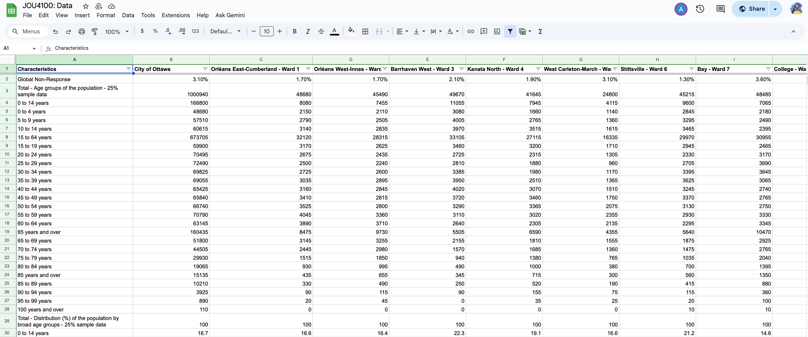
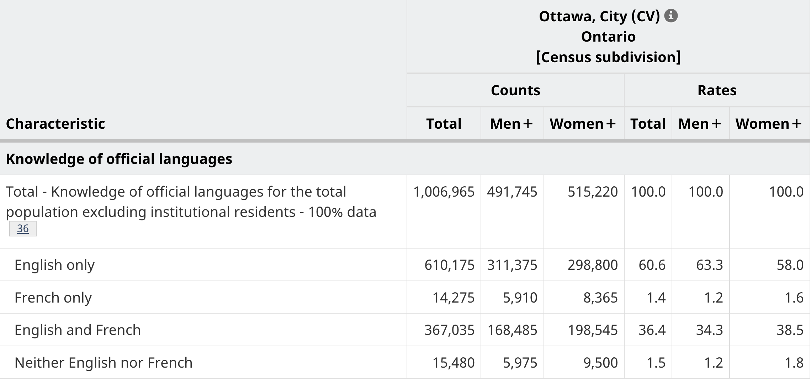
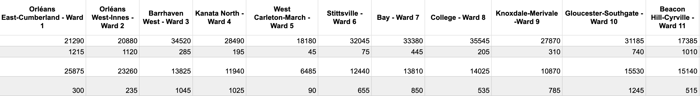
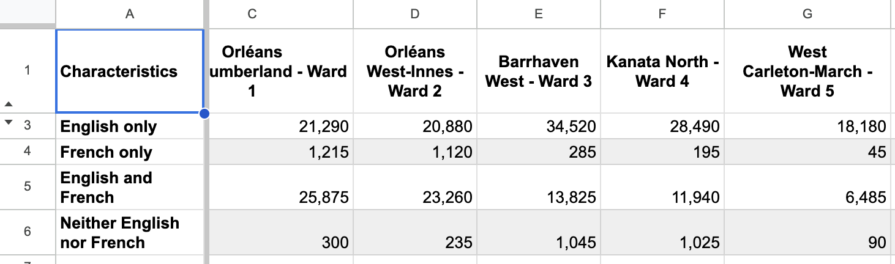
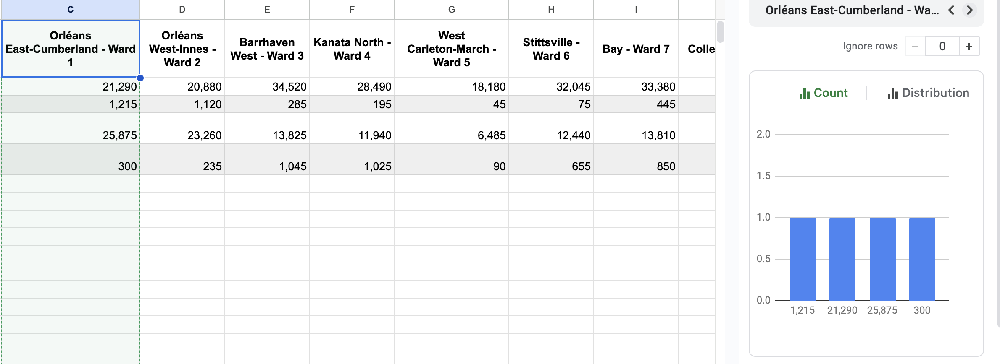

**November 6, 2025** 
**CMN4100/JOU4100: Digital Journalism II** 
**By: Andrew Sorokan, Duc Manh Nguyen, Carlos Lo, Sam Serruya** 
**Presented to Prof. Jean-Sébastien Marier** 

# Exploratory Data Analysis (EDA) & Pitch

## Foreword

For this assignment, you must extract data from a dataset provided by the instructor. You must then clean and analyze the data, create exploratory charts/visualizations, and find a potential story idea. Your assignment must clearly detail your process. You are expected to write about 1500-2000 words, and to include several screen captures showing the different steps you went through. Your assignment must be written with the Markdown format and submitted on GitHub Classroom.

I have been assigning different versions of this project to my digital journalism and data storytelling students for a few years now. Its structure was inspired by the main sections/chapters of [*The Data Journalism Handbook*](https://datajournalism.com/read/handbook/one/). This version was further inspired by the [Key Capabilities in Data Science](https://extendedlearning.ubc.ca/programs/key-capabilities-data-science) program offered by the University of British Columbia (UBC).

**Here are some useful resources for this assignment:**

* [GitHub's *Basic writing and formatting syntax* page](https://docs.github.com/en/get-started/writing-on-github/getting-started-with-writing-and-formatting-on-github/basic-writing-and-formatting-syntax)
* [The template repository for this assignment in case you delete something by mistake](https://github.com/jsmarier/jou4100_jou4500_mpad2003_project2_template)

Did you notice how to create a hyperlink? In Markdown, we put the clickable text between square brackets and the actual URL between parentheses.

And to create an unordered list, we simply put a star (`*`) before each item.

## 1. Introduction

This is the first sentence of the introduction.

## 2. Getting Data

The data was obtained from the city of Ottawa's open data portal. For the data to be displayed on google sheets, a csv file was downloaded from the portal before uploading it on google sheets.

 
Official Link to the file:[(https://docs.google.com/spreadsheets/d/1KXOoNeWieBXd_MXVWqwqiPbALIGjXDVZ9fkCmt_r96c/edit?gid=1595411425#gid=1595411425)]

Prior to cleaning, the data has 2603 rows with 26 columns. The rows can be cleaned to two main categories: a main theme, and the codes which fall under the categories of the theme. On the other hand, rows are separated by the 24 ward districts in Ottawa, with column b being the sole exception, which accounts for the total population in the city of Ottawa. (every ward combined)

In regards to anomalies in the data, column A **Characteristics** is the only column with equal-interval and nominal variables , while other columns contain a ratio variable. An additional observation that could be made, is that despite **Ward 7** (Column I) having a fairly average population sample size in relation to the total population, they account for **11.2%** of the 95 to 99 age groups, vastly outperforming other wards with greater sample size. The impressive stats in older age groups hints at the possibility of higher quality of life as compared to other wards. Lastly, out of all columns, Ward 9 (Column N) heavily underperforms in response rate( **7.60%**) as compared to other wards. This creates a potential story that perhaps the area itself doesn’t have a tight community as compared to other wards, which may explain the lack of responsiveness from its residence.

If we are to formulate a question after looking at the raw data in general, we would want to know what factors are crucial in helping with response rates for the survey. Potential questions that could be asked in an interview are: 

- “what makes you determine whether or not you want to participate in a city of Ottawa survey?"

or 

- "Does your impression of the city councilor affect your decision? to participate”

However, if the question is in the context of a research question, we can change the wording to:

- What factors lead to higher community participation in a Ward District for City of Ottawa surveys?

## 3. Understanding Data

### 3.1. VIMO Analysis

According to Statistics Canada, [accurate data correctly describes the phenomena they were designed to measure or represent](https://www.statcan.gc.ca/en/wtc/data-literacy/catalogue/892000062020008)(Data Accuracy and Validation: Methods to Ensure the Quality of Data, 2020). To assess the accuracy of a data set, a method that professionals usually opt for is the VIMO analysis. Leveraging the VIMO analysis model, our group will evaluate the level of accuracy of our dataset. 

The V in VIMO represents valid data - values that are not blank or missing, and within a range of valid values. On the other hand, invalid data has values that are impossible. There are no invalid values (I) in our dataset, as all the values as variables appropriately indicate the population in private households of each ward. 

Missing values (M) occur when a variable is left blank. In this dataset, no overt missing values were detected. However, there are some covert missing values, which we identified through manual calculations. Column B represents the total household population with knowledge of official languages across all 24 wards in Ottawa. Logically, the sum of the values in all related columns should equal the total values listed in Column B; however, this is not the case.

When we calculated the sum of the population who speaks English using “SUM(C3:Z3), we got the value of 606,200, whereas cell B3 shows 606,195—indicating that five values are missing. While this is not a huge number, it still affects the accuracy of the data. 

Lastly, outlier values (O) are values that significantly deviate from the rest; these values could either be extremely small or extremely large. While nothing out of the blue, we were surprised to see that there are only 30 private household residents reported speaking French exclusively in Ward 21. 

To measure the correctness of the data, we compared this dataset to the 2021 Population Census on the [Knowledge of the official language for the total population excluding institutional residents](https://www12.statcan.gc.ca/census-recensement/2021/dp-pd/prof/details/page.cfm?Lang=E&SearchText=ottawa&DGUIDlist=2021A000011124,2021A00053506008&GENDERlist=1,2,3&STATISTIClist=1,4&HEADERlist=12)(Government of Canada, 2022). There were no major discrepancies, except for minor differences ranging from 0.1% to 0.5% between the two datasets. These differences are not statistically concerning and may be attributed to the sampling methods used - one based on 25% data vs the full 100% census data.

 
*Figure 1: Knowledge of official languges for the total population excluding instituitional residents in Ottawa (Source: [Stats Can](https://www12.statcan.gc.ca/census-recensement/2021/dp-pd/prof/details/page.cfm?Lang=E&SearchText=ottawa&GENDERlist=1,2,3&STATISTIClist=1,4&DGUIDlist=2021A00053506008&HEADERlist=12))*

To sum up, the data is mostly accurate, given that it has an acceptable level of correctness and a decent level of validity. The only issue at stake in this data set is the small number of missing values. 

### 3.2. Cleaning Data

The first function we used for data cleanup was “Freeze Column.” This function keeps an area of a worksheet [visible while you scroll to another area of the worksheet](https://support.microsoft.com/en-us/office/freeze-panes-to-lock-rows-and-columns-dab2ffc9-020d-4026-8121-67dd25f2508f)(Freeze Panes to Lock Rows and Columns, n.d.).Since our dataset contains 26 columns, we decided to freeze Column A, which displays the titles of the variables being measured. Doing so allows us to easily reference what each value represents, even as we navigate through the rest of the data.

To ensure that there were no extra spaces, we used the “Trim whitespace” function by clicking on Data > Data Cleanup > Trim whitespace. 

A function that we used to make the data more readable was changing the [number format](https://support.google.com/docs/answer/56470?hl=en&co=GENIE.Platform%3DDesktop#zippy=%2Ccustom-number-formatting)(Format Numbers in a Spreadsheet, 2019). In the original file, there are no commas in the integers, making it very hard to read. To enhance its readability, we decided to highlight all cells in our dataset (Ctrl + A) and chose the option “custom number format”, which adds a comma as a thousand separator. The only problem that arose after applying this modification is that the system automatically adds two decimal places for all the values. To do so, we Ctrl-A all the cells and select the option to decrease decimal places. 

 
*Figure 3: Before modifying the number format*

 
*Figure 4: After modifying the number format*

As our group plans to analyze the reason behind the difference in the francophone population between each ward, column B and row 2 will not be too important, as they give the overall total population in Ottawa. Regardless, they still serve as important points for reference. As a result, we decided to hide these two elements in the interim. In addition, these two elements need to be hidden in order to generate a graphic that illustrates the number of residents who speak official languages. 

Our group also leveraged the feature “Column Stats” function to observe the count, frequency, and distribution of values. It also allows us to see if there are any empty cells (missing values); as well as duplicates. Fortunately, no errors were detected. 

 
*Figure 4: Using the "Column Stats" function to spot for missing values*

Lastly, to enhance overall readability, our group decided to bold the variable titles. In addition, we highlighted the rows in alternating colors (grey and white) to make each row stand out and prevent misreading values from adjacent rows.

### 3.3. Exploratory Data Analysis (EDA)

When conducting our exploratory data analysis, we aimed to determine the location in Ottawa with the highest proportion of only French-speaking people. We wanted to look at the percentage of French speakers rather than the total French speakers to control for population. To do this, we created a pivot table that provided a percentage of only French-speaking people in each ward. We got this number by dividing the total population by the number of only French speakers and added an array formula to do the calculation for each ward “=ARRAYFORMULA(C4:Z4 / C2:Z2)”. We also multiplied each value by 100 to get a percentage and added an array formula to that one as well “=ARRAYFORMULA(C7:Z7 *100)”.

After we created this pivot table, we also created a column chart to showcase all the percentages of each ward side by side. After we got all the percentages, Wards 12, 13 and 19 were the only wards that had only French-speaking populations over three per cent. This is where we got the story idea to further investigate these three wards. We want to figure out why these three wards have the highest percentages of only French speakers.

Going forward, we would like to see if the percentage of the population lines up with the percentages of services offered in French. For example, what are the percentages of French-only schools in each ward? Answering questions like these will help us form our story. 

**This section should include a screen capture of your pivot table, like so:**

*Figure 2: This pivot table shows...*

**This section should also include a screen capture of your exploratory chart, like so:**

*Figure 3: This exploratory chart shows...*

## 4. Potential Story

For our story, we would like to take a closer look at the top French-speaking wards in Ottawa and write about why they have such a large number of only French speakers. The first thing we are going to do is to look at all the wards and find the wards with the top 3 highest percentages of the French-speaking population. By using the percentage, we can control for population numbers. By percentage of only French-speaking wards 12 (4.26%), 13 (4.17%), and 19 (3.41%) had the most. 

Some factors that we want to look at are how many French schools are in each ward, and if proximity to Quebec means more French speakers. Once we gather this data, we can use interactive maps to show where the schools are and create a heat map of the proportion of French speakers for each ward.

Some of the questions we can explore to answer this question are: 
Are there differences in the resources that are offered in French? 
Are there more French businesses in certain wards?
Are there more French schools? 
Is the proximity to Quebec a factor?

Answering these questions during our interviews should help us create a story that gives a detailed answer to our question. 

For interview subjects, there are many different options. Our first option for interviews will be the ward councillors. These will be important people to talk to, as they would have valuable insight into what is going on in their ward. 

However, because councillors aren’t always available for interviews, we need to plan backups. For this, we plan to talk to business owners and people who live in the wards, along with someone who works for the French School board in Ottawa. 

## 5. Conclusion

Insert text here.

## 6. References
*Data Accuracy and Validation: Methods to ensure the quality of data.* (2020, September 23). Www.statcan.gc.ca. https://www.statcan.gc.ca/en/wtc/data-literacy/catalogue/892000062020008

*Format numbers in a spreadsheet.* (2019). Google Docs Editor Help. https://support.google.com/docs/answer/56470?hl=en&co=GENIE.Platform%3DDesktop#zippy=%2Ccustom-number-formatting

*Freeze panes to lock rows and columns.* (n.d.). Support.microsoft.com. https://support.microsoft.com/en-us/office/freeze-panes-to-lock-rows-and-columns-dab2ffc9-020d-4026-8121-67dd25f2508f

Government of Canada, S. C. (2022, February 9). *Profile table, Census Profile, 2021 Census of Population - Canada [Country]*. Www12.Statcan.gc.ca. https://www12.statcan.gc.ca/census-recensement/2021/dp-pd/prof/details/page.cfm?Lang=E&SearchText=ottawa&DGUIDlist=2021A000011124

[def]: google-sheets.png