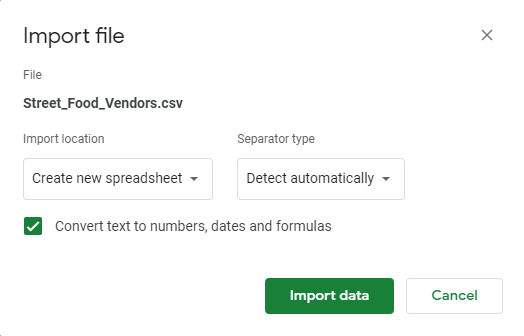
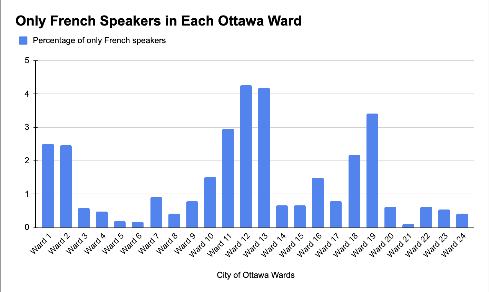

**Date**<br>
**Course Code & Course Name**<br>
**Student's First Name & Last Name**<br>
**Presented to Jean-Sébastien Marier**<br>

# Exploratory Data Analysis (EDA) & Pitch

Use one hashtag symbol (`#`) to create a level 1 heading like this one.

## Foreword

For this assignment, you must extract data from a dataset provided by the instructor. You must then clean and analyze the data, create exploratory charts/visualizations, and find a potential story idea. Your assignment must clearly detail your process. You are expected to write about 1500-2000 words, and to include several screen captures showing the different steps you went through. Your assignment must be written with the Markdown format and submitted on GitHub Classroom.

I have been assigning different versions of this project to my digital journalism and data storytelling students for a few years now. Its structure was inspired by the main sections/chapters of [*The Data Journalism Handbook*](https://datajournalism.com/read/handbook/one/). This version was further inspired by the [Key Capabilities in Data Science](https://extendedlearning.ubc.ca/programs/key-capabilities-data-science) program offered by the University of British Columbia (UBC).

**Here are some useful resources for this assignment:**

* [GitHub's *Basic writing and formatting syntax* page](https://docs.github.com/en/get-started/writing-on-github/getting-started-with-writing-and-formatting-on-github/basic-writing-and-formatting-syntax)
* [The template repository for this assignment in case you delete something by mistake](https://github.com/jsmarier/jou4100_jou4500_mpad2003_project2_template)

Did you notice how to create a hyperlink? In Markdown, we put the clickable text between square brackets and the actual URL between parentheses.

And to create an unordered list, we simply put a star (`*`) before each item.

## 1. Introduction

This is the first sentence of the introduction.

## 2. Getting Data

The data was obtained from the city of Ottawa's open data portal. For the data to be displayed on google sheets, a csv file was downloaded from the portal before uploading it on google sheets.
Prior to cleaning, the data has 2603 rows with 26 columns. The rows can be cleaned to two main categories: a main theme, and the codes which fall under the categories of the theme. On the other hand, rows are separated by the 24 ward districts in Ottawa, with column b being the sole exception, which accounts for the total population in the city of Ottawa. (every ward combined)

In regards to anomalies in the data, column A (Characteristics) is the only column with equal-interval and nominal variables , while other columns contain a ratio variable. An additional observation that could be made, is that despite Ward 7 (Column I) having a fairly average population sample size in relation to the total population, they account for 11.2% of the 95 to 99 age groups, vastly outperforming other wards with greater sample size. The impressive stats in older age groups hints at the possibility of higher quality of life as compared to other wards. Lastly, out of all columns, Ward 9 (Column N) heavily underperforms in response rate( 7.60%) as compared to other wards. This creates a potential story that perhaps the area itself doesn’t have a tight community as compared to other wards, which may explain the lack of responsiveness from its residence.

If we are to formulate a question after looking at the raw data in general, we would want to know what factors are crucial in helping with response rates for the survey. A question that could be asked in interviews is: “what makes you determine whether or not you want to participate in a city of Ottawa survey? And does your impression of the city councilor affect that decision?”.

Use two hashtag symbols (`##`) to create a level 2 heading like this one.

To include a screen capture, use the sample code below. Your images should be saved in the same folder as your `.md` file.

<br>
*Figure 1: The "Import file" prompt on Google Sheets.*

**Here are examples of functions and lines of code put in grey boxes:**

1. If you name a function, put it between "angled" quotation marks like this: `IMPORTHTML`.
1. If you want to include the entire line of code, do the same thing, albeit with your entire code: `=IMPORTHTML("https://en.wikipedia.org/wiki/China"; "table", 5)`.
1. Alternatively, you can put your code in an independent box using the template below:

``` r
=IMPORTHTML("https://en.wikipedia.org/wiki/China"; "table", 5)
```
This also shows how to create an ordered list. Simply put `1.` before each item.

## 3. Understanding Data

### 3.1. VIMO Analysis

Use three hashtag symbols (`###`) to create a level 3 heading like this one. Please follow this template when it comes to level 1 and level 2 headings. However, you can use level 3 headings as you see fit.

Insert text here.

Support your claims by citing relevant sources. Please follow [APA guidelines for in-text citations](https://apastyle.apa.org/style-grammar-guidelines/citations).

**For example:**

As Cairo (2016) argues, a data visualization should be truthful...

### 3.2. Cleaning Data

Insert text here.

### 3.3. Exploratory Data Analysis (EDA)

When conducting our exploratory data analysis, we aimed to determine the location in Ottawa with the highest proportion of only French-speaking people. We wanted to look at the percentage of French speakers rather than the total French speakers to control for population. To do this, we created a pivot table that provided a percentage of only French-speaking people in each ward. We got this number by dividing the total population by the number of only French speakers and added an array formula to do the calculation for each ward “=ARRAYFORMULA(C4:Z4 / C2:Z2)”. We also multiplied each value by 100 to get a percentage and added an array formula to that one as well “=ARRAYFORMULA(C7:Z7 *100)”.


After we created this pivot table, we also created a column chart to showcase all the percentages of each ward side by side. After we got all the percentages, Wards 12, 13 and 19 were the only wards that had only French-speaking populations over three per cent. This is where we got the story idea to further investigate these three wards. We want to figure out why these three wards have the highest percentages of only French speakers.

Going forward, we would like to see if the percentage of the population lines up with the percentages of services offered in French. For example, what are the percentages of French-only schools in each ward? Answering questions like these will help us form our story. 


**This section should include a screen capture of your pivot table, like so:**


*Figure 2: This pivot table shows...*

**This section should also include a screen capture of your exploratory chart, like so:**


*Figure 3: This exploratory chart shows...*

## 4. Potential Story

For our story, we would like to take a closer look at the top French-speaking wards in Ottawa and write about why they have such a large number of only French speakers. The first thing we are going to do is to look at all the wards and find the wards with the top 3 highest percentages of the French-speaking population. By using the percentage, we can control for population numbers. By percentage of only French-speaking wards 12 (4.26%), 13 (4.17%), and 19 (3.41%) had the most. 

Some factors that we want to look at are how many French schools are in each ward, and if proximity to Quebec means more French speakers. Once we gather this data, we can use interactive maps to show where the schools are and create a heat map of the proportion of French speakers for each ward.

Some of the questions we can explore to answer this question are: 
Are there differences in the resources that are offered in French? 
Are there more French businesses in certain wards?
Are there more French schools? 
Is the proximity to Quebec a factor?

Answering these questions during our interviews should help us create a story that gives a detailed answer to our question. 

For interview subjects, there are many different options. Our first option for interviews will be the ward councillors. These will be important people to talk to, as they would have valuable insight into what is going on in their ward. 

However, because councillors aren’t always available for interviews, we need to plan backups. For this, we plan to talk to business owners and people who live in the wards, along with someone who works for the French School board in Ottawa. 


## 5. Conclusion

Insert text here.

## 6. References

Include a list of your references here. Please follow [APA guidelines for references](https://apastyle.apa.org/style-grammar-guidelines/references). Hanging paragraphs aren't required though.

**Here's an example:**

Bounegru, L., & Gray, J. (Eds.). (2021). *The Data Journalism Handbook 2: Towards A Critical Data Practice*. Amsterdam University Press. [https://ocul-crl.primo.exlibrisgroup.com/permalink/01OCUL_CRL/hgdufh/alma991022890087305153](https://ocul-crl.primo.exlibrisgroup.com/permalink/01OCUL_CRL/hgdufh/alma991022890087305153)
